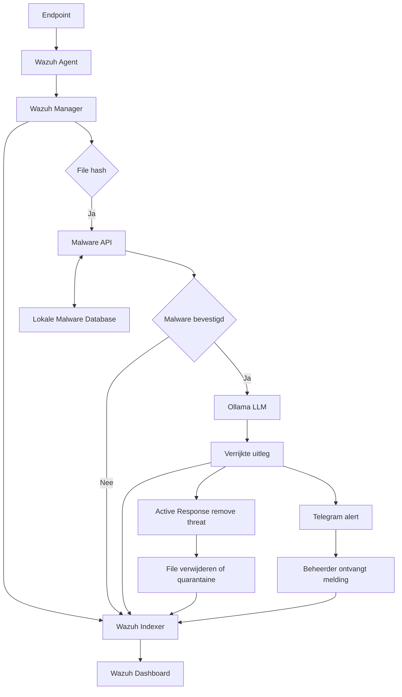

# VTCS Project 25-26

A ready-to-run stack that ships:
- Wazuh manager, indexer, and dashboard (security monitoring)
- Malware API service (FastAPI)
- Ollama LLM service

This guide is written for non-technical users. Follow the steps in order and copy/paste the commands as shown.

## Architecture


## What you need
- Docker and Docker Compose installed
- Internet connection (images will be pulled on first run)
- At least 15 GB free disk space for images and data
- At least 8 GB RAM (absolute minimum 4 GB) and 2 CPU cores; more memory gives a smoother Wazuh dashboard
- Docker will start 5 containers: Wazuh manager, Wazuh indexer, Wazuh dashboard, malware-api, and ollama

## 1) Prepare the settings
1. Copy the environment example file:
   - Windows (PowerShell): `Copy-Item .env.example .env`
   - macOS/Linux (bash): `cp .env.example .env`
2. Open `.env` and set the passwords:
   - `ADMIN_PASSWORD` — used by Wazuh indexer/admin
   - `KIBANASERVER_PASSWORD` — used by the Wazuh dashboard
   - `READONLY_USER_PASSWORD` - used for normal users that are only allowed to use Wazuh.
   - Optionally change `MALWARE_API_KEY` and Ollama settings
   - Pick strong, memorable passwords.

## 2) Run the setup (one time)
Run the script that matches your system from the project root:
- Windows (PowerShell): `./setup.ps1`
  - If you get an error about execution policy, first allow scripts to run (one time):
    ```powershell
    Set-ExecutionPolicy -ExecutionPolicy RemoteSigned -Scope CurrentUser
    ```
    Then run `./setup.ps1` again.
- macOS/Linux: `./setup.sh`

What the setup does for you:
- Generates SSL certificates for Wazuh indexer
- Creates `internal_users.yml` with hashed passwords from your `.env`
- Starts all containers with Docker Compose
- Reloads Wazuh security so the new passwords are active

If required passwords are missing in `.env`, the script stops and tells you what to add.

## 3) Using the services
- Wazuh Dashboard: https://localhost (use `kibanaserver` / your `KIBANASERVER_PASSWORD`)
- Malware API: http://localhost:8000 (API key from `.env`)


## Common actions
- Stop all: `docker compose down`
- Start again: `docker compose up -d`
- View container status: `docker compose ps`
- View dashboard logs: `docker logs vtcs-project-25-26-wazuh.dashboard-1 --tail 50`
- View indexer logs: `docker logs vtcs-project-25-26-wazuh.indexer-1 --tail 50`

## Troubleshooting
- Login fails on dashboard: ensure `.env` has correct `KIBANASERVER_PASSWORD`, re-run setup, then restart dashboard: `docker compose restart wazuh.dashboard`
- Admin auth fails: check `ADMIN_PASSWORD` in `.env`, re-run setup, try to reload security:
  `docker exec vtcs-project-25-26-wazuh.indexer-1 bash -c "JAVA_HOME=/usr/share/wazuh-indexer/jdk /usr/share/wazuh-indexer/plugins/opensearch-security/tools/securityadmin.sh -cd /usr/share/wazuh-indexer/config/opensearch-security -icl -key /usr/share/wazuh-indexer/config/certs/admin-key.pem -cert /usr/share/wazuh-indexer/config/certs/admin.pem -cacert /usr/share/wazuh-indexer/config/certs/root-ca.pem -h wazuh.indexer"`
- Ports in use: stop any service occupying 443, 8000, 9200, 11434, or 1514/1515.

## Where data lives
Docker volumes keep your data between runs (malware API DB, Wazuh data, dashboard config). Removing volumes will reset stored data.


## How to deploy the agent
This will be an easy step-to-step how to install the agent

- Step 1. Extract the directory: 'install-wazuh-agent-gui-windows.zip'.
- Step 2. Click on: 'install-wazuh-agent-gui.exe' and when the notification appears click: 'yes'.
- Step 3. In the field of: 'Wazuh manager IP' type the IP adress of the default gateway of Wazuh. Mostly it IP adres will is like: 'x.x.x.1'. Also, it will be adviced to type a name of the agent you want to create. That way you know what the agent is that you have created. Then you can click on: 'installation'. You will get a notification that the Wazuh agent is installed succesfully. It is also adviced to clear the log by clicking: 'Clear log'
- Step 4. In order to see if everything is installed you click on the directory: 'ossec-agent'. Then you click on the directory: 'active-response'. Then you click on the directory: 'bin'. There you see 4 files where on of the files is called: 'remove-threat.exe' This will be further down in this README.md

## How does the notification work
If the user (accidently) opens the malware in Windows and Linux the Wazuh detects the malware and deletes it. This feature is possible, because there is a file (remove-threat.exe) that was mentioned earlier in the README.md. The question that still remains is how can the user see what has been happening.

- Step 1. Go to: 'Summary'. That is the first option under section: 'Agents management'
- Step 2. Click on the host where the user (accidently) clicked on the malware.
- Step 3. You can see in the rule description that the malware has been detected, deleted and it tells the location where the malware was. 