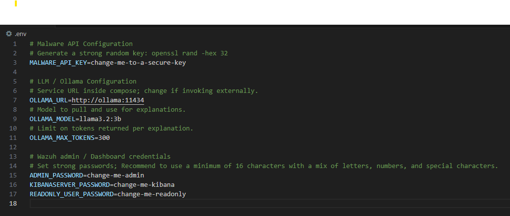
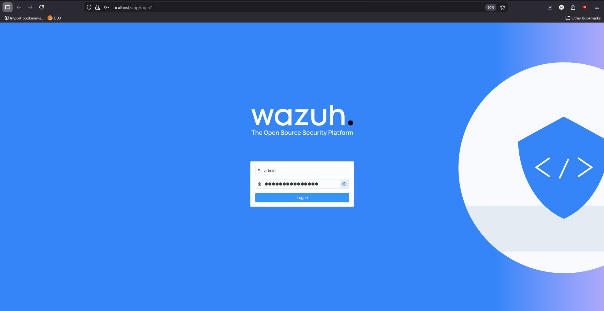
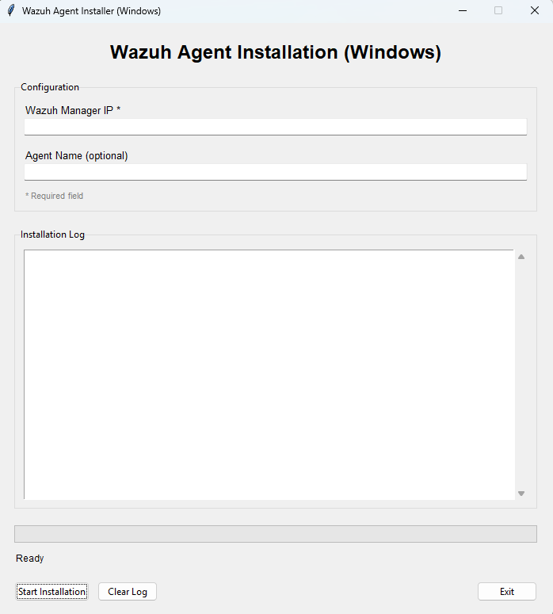
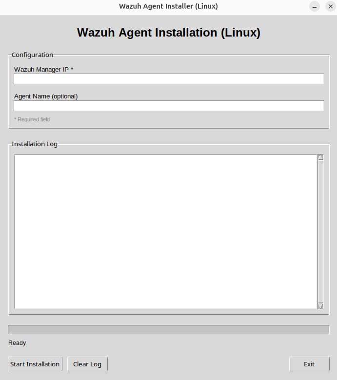
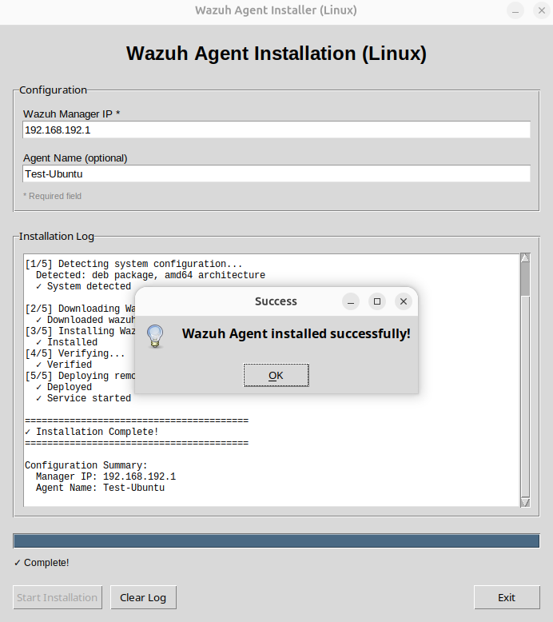
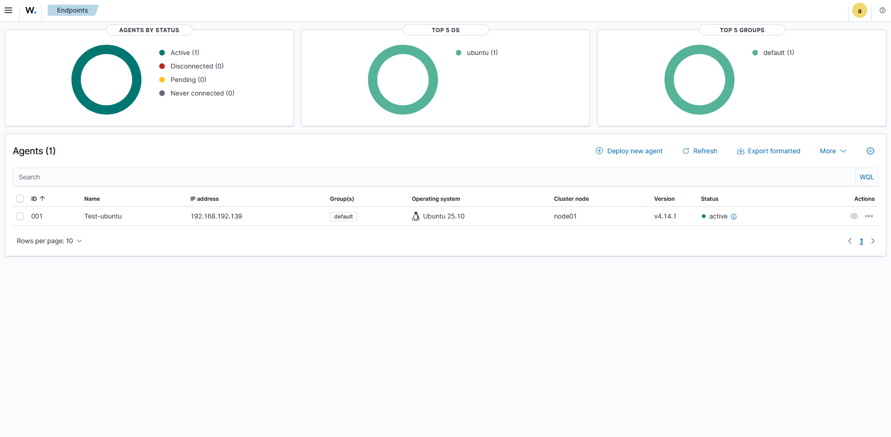

# Installatiegids voor MKB-ondernemingen

Deze gids helpt je de Wazuh product lokaal te installeren.

## 1. Overzicht
- Doel: lokale opzet van Wazuh (Manager/Indexer/Dashboard), Malware API (FastAPI) en Ollama (LLM) via Docker Compose.
- Resultaat: werkend dashboard op HTTPS, API bereikbaar, en een Windows-agent die events doorstuurt.

### Voor wie is deze gids?
- Voor MKB-ondernemingen die een kant-en-klaar pakket willen draaien.
- Geen diepgaande IT-kennis nodig; volg de stappen in deze gids.
- Begrippen:
  - Wazuh Manager: de server die agents beheert.
  - Wazuh Agent: software op werkstations/servers die events doorstuurt.
  - Dashboard: webpagina voor inzicht en beheer.

## 2. Systeemvereisten
- Linux server (aanbevolen) met 24/7 beschikbaarheid, bijv. Ubuntu Server 22.04/24.04 LTS.
- Docker Engine 24+ met Compose v2 (plugin) op de server.
- Alternatief: Windows 11/Windows Server met Docker Desktop (Compose v2).
- Internettoegang (voor images en dataset-downloads).
- 4 cores
- 8gb ram

## 3. Configuratie en beveiliging
Het systeem gebruikt een `.env`-bestand voor alle configuratie-instellingen:
- **Wachtwoorden**: voor Wazuh admin, dashboard en read-only gebruiker.
- **API-sleutels**: voor de Malware API.
- **Telegram**: optioneel, voor beveiligingsalerts.

Dit bestand wordt automatisch aangemaakt en geconfigureerd door het setup-script (zie hoofdstuk 5.2).

**Belangrijk**: gebruik sterke wachtwoorden (minimaal 8 tekens, aanbevolen 16+ met letters, cijfers en speciale tekens).


## 4. Services en poorten
- Ollama: http://localhost:11434
- Malware API: http://localhost:8000
- Wazuh Indexer: https://localhost:9200
- Wazuh Dashboard: https://localhost (hostpoort 443 → container 5601)

Zie ook `docker-compose.yml` voor de volledige configuratie.

## 5. Installeren en starten
### 5.1 Projectmap voorbereiden
- Plaats de projectbestanden in een map naar keuze, bijvoorbeeld `C:\Deploy\<Projectnaam>`.
- De mapnaam (bijv. `AutomatedIR_HvA`) is tijdelijk en mag aangepast worden; Docker Compose gebruikt relatieve paden en blijft werken na hernoemen.

### 5.2 Setup-script uitvoeren (verplicht)
Voer altijd eerst het setup-script uit voordat je containers start.

**Windows/PowerShell:**
```powershell
.\setup.ps1
```

**Linux/Bash:**
```bash
./setup.sh
```

#### Wat doet het setup-script?
1. **Controleert of `.env` bestaat**:
   - Bestaat niet? Het script maakt deze aan en vraagt interactief om configuratie.
   - Bestaat wel? Het script gebruikt de bestaande configuratie.

2. **Vraagt om wachtwoorden** (alleen bij eerste keer):
   - **Admin Password**: voor de Wazuh admin-gebruiker (minimaal 8 tekens, aanbevolen 16+).
   - **Kibana Server Password**: wordt automatisch gegenereerd.
   - **Read-Only User Password**: voor alleen-lezen toegang (minimaal 8 tekens, aanbevolen 16+).
   
   Bij elk wachtwoord kun je kiezen:
   - **Druk op Enter**: automatisch gegenereerd sterk wachtwoord (16 tekens).
   - **Typ een wachtwoord**: voer je eigen wachtwoord in en bevestig.

3. **Telegram-configuratie** (optioneel):
   - Keuze om Telegram-alerts in te stellen voor beveiligingsmeldingen.
   - Het script haalt automatisch je Chat ID op via de Telegram API.

4. **Genereert SSL-certificaten** en configureert Wazuh-services.

5. **Start alle containers** automatisch via Docker Compose.

Voorbeeld tijdens setup:
```
Enter Admin Password (minimum 8 characters)
(Press Enter to generate, or type your password): [druk Enter]
[INFO] Generated password: aB3dEf9!ghiJkL2m
```

### 5.4 Wazuh openen
- Open: https://localhost (HTTPS).
- Log in met één van de volgende accounts:
  - `admin` + jouw `ADMIN_PASSWORD`.
  - `readonly_user` + jouw `READONLY_USER_PASSWORD` (alleen‑lezen).



Tip: voeg de URL toe aan Favorieten en controleer na inloggen of bovenin het Dashboard geen foutmeldingen verschijnen.

## 6. Wazuh Agent installeren (Windows en Linux endpoints)
Gebruik de meegeleverde GUI-installers (zip-bestanden) om de agent eenvoudig te installeren en te registreren.

Kies hieronder het scenario dat past: intern (agents binnen eigen netwerk) of extern (agents buiten het netwerk).

### 6.1 Intern gebruik (Agents geen toegang buiten het netwerk)
Gebruik het IP-adres van de server waar de Wazuh Manager draait als "Manager host/IP" in de GUI bij de stappen hierna. deze kan je vinden via:

Windows server:
```powershell
ipconfig
```

Linux server:
```bash
ifconfig
```

### 6.2 Extern gebruik (agents hebben toegang buiten het netwerk)
Gebruik het externe IP-adres of DNS-naam van jouw locatie. Hierbij is nodig dat poort 1514 en 1515 zijn geforward naar de manager-server (zie 6.2.1).

Windows server:
```powershell
(Invoke-WebRequest https://ipinfo.io/ip).Content.Trim()
```

Linux server:
```bash
curl -s https://ipinfo.io/ip
```

#### 6.2.1 Netwerkvereisten: poorten en port-forwarding (alleen bij extern gebruik)
Voor een werkende verbinding tussen agent en Wazuh Manager zijn onderstaande poorten nodig. Stel firewallregels en, indien agents van buiten het netwerk verbinden, port-forwarding in op de router/firewall.

- 1514 (Agent connection service): UDP en TCP naar de Manager-server.
- 1515 (Agent enrollment service): TCP naar de Manager-server.

Port-forwarding (indien nodig):
- Router/firewall extern → intern: 
  - Extern UDP/TCP 1514 → Intern Server IP:1514
  - Extern TCP 1515 → Intern Server IP:1515
- Doel: inkomend verkeer op de openbare poorten doorsturen naar de Manager-server binnen het netwerk.

Aanbevolen beveiliging:
- Beperk bron-IP’s tot vertrouwde locaties of gebruik een PROXY/VPN in plaats van directe blootstelling.
- Test bereikbaarheid (ping/traceroute) en controleer dat de firewall de poorten niet blokkeert.

### 6.3 Windows: install-wazuh-agent-gui-windows.zip
1. Kopieer `install-wazuh-agent-gui-windows.zip` naar het Windows endpoint en pak het uit.
2. Dubbelklik op `install-wazuh-agent-gui.exe`.
3. GUI-overzicht (Windows):
  - Velden: Wazuh Manager IP (verplicht), Agent Name (optioneel)
  - Paneel: Installation Log (weergave van voortgang en meldingen)
  - Knoppen: Start Installation, Clear Log, Exit
  - Status: Ready wanneer klaar om te starten
4. Stappen:
  - Vul Wazuh Manager IP in (IP van de server; zie "Manager IP-adres opzoeken")
  - Optioneel: vul een Agent Name in (voor herkenbaarheid)
  - Klik op Start Installation en volg de logmeldingen
  - Wacht op succesvolle afronding (geen fouten in Installation Log)
5. Controleer in het Dashboard dat de agent zichtbaar wordt.



### 6.4 Linux: install-wazuh-agent-gui-linux.zip
1. Kopieer `install-wazuh-agent-gui-linux.zip` naar het Linux endpoint en pak het uit.
2. Maak de installer uitvoerbaar en start met beheerrechten:
```bash
chmod +x install-wazuh-agent-gui
sudo ./install-wazuh-agent-gui
```
3. GUI-overzicht (Linux):
  - Velden: Wazuh Manager IP (verplicht), Agent Name (optioneel)
  - Paneel: Installation Log
  - Knoppen: Start Installation, Clear Log, Exit
  - Status: Ready
4. Stappen:
  - Vul Wazuh Manager IP in (IP van de server; zie "Manager IP-adres opzoeken")
  - Optioneel: Agent Name
  - Klik op Start Installation en volg de logmeldingen
  - Wacht op succesvolle afronding
5. Controleer in het Dashboard dat de agent zichtbaar wordt.



### 6.5 Succesmelding en valkuilen
Als de installatie gelukt is, zie je een succesvenster (bijv. "Wazuh Agent installed successfully!") en onderaan in het Installation Log een samenvatting met "Installation Complete!".




Let op:
- Bij een verkeerd of onbereikbaar Manager IP kan de GUI soms geen duidelijke foutmelding geven; de stappen lijken succesvol, maar de agent maakt geen verbinding.
- Controleer altijd in het Wazuh Dashboard of de agent daadwerkelijk verschijnt en "active" wordt.
- Verschijnt de agent niet? Controleer het IP-adres (geen loopback/juist IP), netwerkbereik (ping), firewallregels/poorten (1514 en 1515), en of de Manager draait.

Opmerking: in beide zip-pakketten zit ook een `remove-threat` tool (Windows: `remove-threat.exe`, Linux: `remove-threat`). Gebruik deze uitsluitend in een testomgeving voor demonstraties van actieve respons.

### 6.6 controleren succesvol installeren agent
De agent is succesvol geïnstalleerd als deze op het dashboard zichtbaar is (zie screenshot). Het kan even duren voordat de agent verschijnt. Het overzicht is te vinden op: https://localhost/app/endpoints-summary#/agents-preview




## 7. Controlelijst na installatie
- Dashboard: https://localhost/app/dashboards#/view/Malware_Dashboard opent en je kunt inloggen met jouw gegevens.
- Dashboard toont gegevens en is stabiel (geen foutmeldingen bovenin).
- Agent: na installatie via de GUI verschijnt de agent in het Dashboard en staat op "active".
- Malware API: http://localhost:8000/health toont een OK-status.
- Wachtwoorden en sleutels: staan correct ingevuld en zijn niet op standaardwaarden.
- Netwerk: poorten 1514/1515 staan open; verbinding naar het Server IP werkt.
 Klopt iets niet? Ga naar Probleemoplossing (hoofdstuk 8).

## 8. Probleemoplossing
- Containers starten niet: controleer poortconflicten en `.env`-waarden.
- Dashboard onbereikbaar: controleer dat poort 443 vrij is en dat de container draait.
- Agent niet zichtbaar: check serveradres/poorten (1514/1515) en firewallregels.
- API geeft 401/403: controleer `X-API-Key` en `MALWARE_API_KEY` in `.env`.